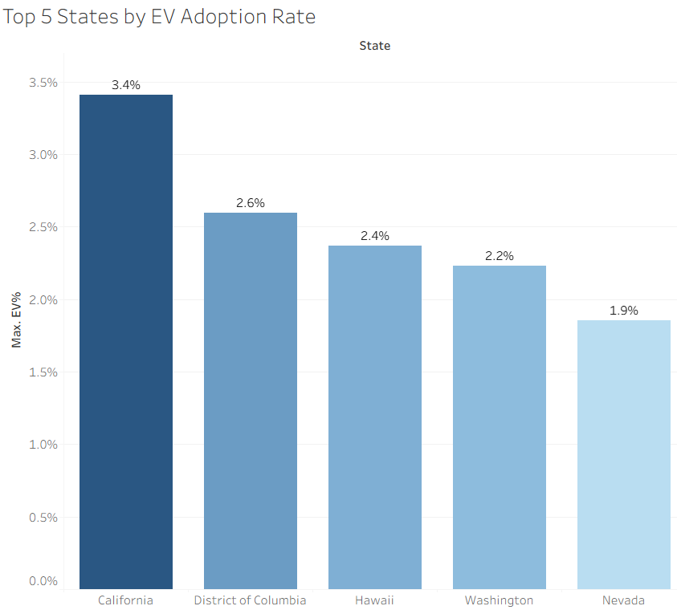
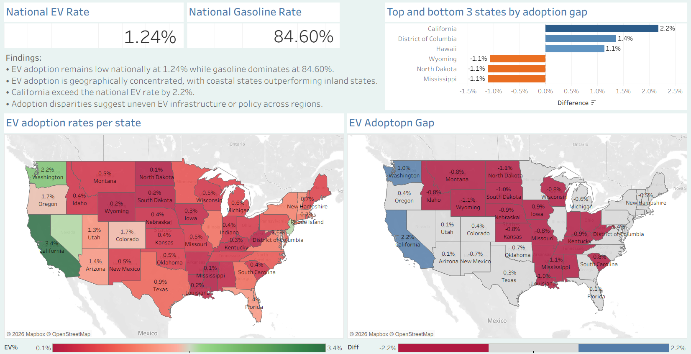

# Exploratory Data Analysis of Electric Vehicle Adoption in the USA

## 📌 Project Overview

This project provides an exploratory data analysis (EDA) of vehicle registration counts by fuel type in order to evaluate state-level EV adoption, benchmark performance against the national average, and identify regions where EV infrastructure investment may be prioritized.

Studying EV adoption rates helps measure progress toward cleaner and more sustainable transportation. As governments and industries work to reduce emissions and reliance on fossil fuels, EV adoption becomes a key indicator of energy transition. Understanding geographic differences in adoption supports informed infrastructure planning and strategic investment decisions.

## 🎯 Problem Statement

This analysis aims to:

 * Measure EV adoption rates across U.S. states.

 * Compare state-level adoption against the national benchmark.

 * Identify leading and lagging states.

 * Highlight regions where EV infrastructure expansion may be most impactful.

 ## 📂 Dataset Description

 The dataset used contains vehicle registration counts for each U.S. state, categorized by fuel type.

Each row represents one state.
Columns represent absolute registration counts for:

 * Electric (EV)
 * Plug-In Hybrid Electric (PHEV)
 * Hybrid Electric (HEV)
 * Biodiesel
 * Ethanol/Flex (E85)
 * Compressed Natural Gas (CNG)
 * Propane
 * Hydrogen
 * Methanol
 * Gasoline
 * Diesel
 * Unknown fuel

 ### Note: The dataset contains absolute counts and does not include a time dimension. The data is synthetic and used for analytical demonstration purposes.

 ## 🛠 Tools Used

 * SQL (MySQL) – Data aggregation, metric computation

 * Excel – Result verification

 * Tableau – Data visualization

## 📊 The Analysis

### 🔵 State-Level Distribution of EV, PHEV, HEV, and Gasoline Vehicles

#### Key Findings

 * Gasoline vehicles dominate across all states, accounting for over 80% of total registered vehicles.
 * EV adoption rates remain relatively low nationwide, with the highest shares observed in California (3.41%), followed by the District of Columbia (2.60%) and Hawaii (2.37%).
 * The District of Columbia records the highest PHEV (1.19%) and HEV (5.80%) shares, indicating stronger hybrid adoption relative to most states. HEVs demonstrate broader appeal compared to EVs and PHEVs across the majority of states.
 * The lowest EV, PHEV, and HEV adoption rates are observed in states such as North Dakota and Mississippi, highlighting regional disparities in electrification.

 #### Interpretation

 Overall, vehicle registration data suggests that electrification of U.S. vehicles remains in an early adoption phase, with hybrid technologies (PHEV and HEV) acting as a transitional step in many states.

 ### 🔵 Top and Bottom 5 States by EV Adoption Rate
 

  

 
 #### Interpretation

The highest recorded EV adoption rate is observed in California (3.4%), followed by the District of Columbia (2.6%), Hawaii (2.4%), Washington (2.2%), and Nevada (1.9%). 

While these states lead nationally, adoption rates remain relatively modest overall, with even the top-performing state below 4%, indicating that EV penetration is still in an early growth phase. Notably, most of the leading states are located on the West Coast or in coastal regions, suggesting a geographic concentration of higher EV adoption that will be further explored in the dashboard analysis.

### 🔵 National Distribution of Alternative Fuel Types 

#### Key Findings

* Among alternative fuel solutions, ethanol shows the greatest national adoption rate at 7.05%, significantly outperforming biodiesel (0.98%) and hydrogen (0.01%).

#### Interpretation

This indicates that ethanol-blended fuels are currently the most established alternative to traditional gasoline, while biodiesel remains a niche option and hydrogen adoption is still negligible at a national level.

### 🔵 Comparing EV Adoption Rate of California to Florida, New-York, and Texas 

### Key Findings 

* California’s EV adoption rate (3.41%) significantly exceeds that of other large states such as Florida (1.37%), New York (1.16%), and Texas (0.89%). 

#### Interpretation

 Despite comparable population sizes, these states show much lower adoption levels, indicating that market size alone does not determine EV penetration. The gap suggests that policy frameworks, infrastructure investment, and regional environmental priorities likely play a substantial role in accelerating EV adoption.

 While California clearly acts as a market leader in EV adoption, other large states like those previously mentioned represent significant opportunities for future growth. Given their large populations and economic scale, even modest investments in EV infrastructure can translate into substantial gains. 

 ### 🔵 Measuring State Performance Relative to the National EV Average

#### Note: The adoption gap represents the difference between the state-level EV adoption rate and the national average EV adoption rate. 

This metric highlights which states are outperforming or underperforming relative to the national benchmark, allowing for clearer identification of leading, emerging, and lagging EV markets across the country.

 ### Key Findings

 * The adoption gap analysis reveals a highly uneven EV transition across the United States. 
 * While a small group of states — particularly California (+2.17%), Washington (+0.99%), Hawaii (+1.13%), and the District of Columbia (+1.35%) — significantly outperform the national average, the majority of states fall below it. This indicates that EV adoption is geographically concentrated, with coastal and urbanized regions leading the transition while many Southern and Plains states remain substantially behind.
 * The largest negative adoption gaps are observed in North Dakota (−1.11%), Mississippi (−1.11%), and Wyoming (−1.07%), indicating that EV adoption in these states is significantly below the national average and highlighting substantial room for future market development.

 ## 🚗 Dashboard Overview

 To complement the SQL analysis, an interactive Tableau dashboard was developed to visually explore EV adoption patterns across states. The dashboard highlights national benchmarks, geographic concentration, and relative performance gaps to support clearer interpretation of the data.

  

## Conclusion

This analysis reveals that EV adoption in the United States remains in an early stage, with a national rate of just 1.24% and gasoline continuing to dominate the vehicle landscape. Adoption is not evenly distributed, as a small number of coastal states significantly outperform the national average while most states lag behind, creating clear regional disparities.

The findings suggest that infrastructure availability, policy incentives, and regional priorities play a critical role in accelerating EV penetration. While leading states demonstrate what is achievable, substantial growth opportunities remain in underperforming regions, indicating that the national EV transition is still developing and far from uniform.

 

